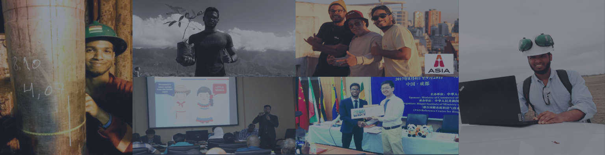

```{r setup, include=FALSE}
knitr::opts_chunk$set(echo = TRUE)
```


|   Celular   |                                     Email                                      |      Domicilio       |                             RRSS                             |
|:---------------:|:---------------:|:--------------------:|:---------------:|
| 11 27557211 | [cesar.joyce.briceno\@gmail.com](mailto:cesar.joyce.briceno@gmail.com){.email} | CABA - Villa Urquiza | @cesar.joyce / [LinkedIn](www.linkedin.com/in/césar-briceño) |

------------------------------------------------------------------------


#### Inspector de Calidad - QA/QC \| Bureau Veritas

##### Buenos Aires \| 2023 - 2024

-   Acompaño a cada inspector en su área en la supervisión para la implementación de los procedimientos de calidad que se desprenden del Plan de Inspección y Ensayo del Proyecto de Construcción Planta Compresora de Gas Mercedes.
-   Verifico y organizo los registros y documentación de los datos esenciales para la trazabilidad en las áreas de Civil, Piping, Electricidad e Instrumentación.

#### Administrativo de Obra Oil & Gas \| Bureau Veritas

##### Buenos Aires \| 2022 - 2023

-   Gestioné para sus firmas y archivo los documentos de comunicaciones, minutas de reuniones, reportes de inspección.
-   Coordiné actividades administrativas para el apoyo logístico del equipo.

#### Ingeniero Analista & Gestor de Proyectos \| Viceministerio de Gas - Ministerio de Petróleo

##### Caracas \| 2015 - 2022

-   Controlé el seguimiento técnico - administrativo de los Planes de Trabajo Anuales de PDVSA y empresas transnacionales adjudicadas con licencias para el desarrollo de lotes de gas natural no asociado.
-   Gestioné proyectos internos y actividades del equipo de la Dirección General de Producción de Gas Natural del Ministerio de Petróleo, para la generación de propuestas y presentaciones ejecutivas para el Directorio, reuniones de trabajo con empresas y organizaciones internacionales.

#### Ingeniero de Campo - Perforador Direccional \| Halliburton

##### Anzoátegui - Maturin \| 2011 - 2014

-   Ejecuté planes de perforación como Perforador Direccional de pozos exploratorios y desarrollos en la FPO. Supervisé operaciones de perforación guiando la cuadrilla y controlando los parámetros para garantizar la trayectoria planificada. Elaboré informes sobre los avances de la perforación, gestión de herramientas BHA.
-   Tesis y Práctica Universitaria, elaboré en la Gerencia de Perforación de PDVSA PETROPIAR (PDVSA - CHEVRON) un Manual de Perforación de Pozos Horizontales en el Campo Huyaparí de la FPO (2011 - 2012).


#### Diplomatura en Gestión y Tecnología para el Desarrollo Convencional y No Convencional de Hidrocarburos

-   Universidad Nacional Patagonia Austral
-   Caleta Olivia \| 2023 - Presente

#### Diplomatura Tecnología de Energía Renovable Biogás

-   Instituto BIOMA China
-   Chengdu \| 2017

#### Ingeniería de Petróleo

-   Universidad Central de Venezuela
-   Caracas \| 2012


-   Idioma Inglés Avanzado
-   MS Microsoft 
-   Lenguaje R (muy básico a partir de estos momentos)
-   Emprendimiento: Marca de prendas ORFE | [@Orfeoficial](https://www.instagram.com/orfeoficial/?hl=es) | 2016 - 2021 
-   Piloto aficionado VANT/Dron Civil - Clase A - Audioviduales
-   Co-fundador y Co-productor del canal de Youtube ASIA - Música Electrónica [@ASIA](https://www.youtube.com/@Asiapresents)
   
-   Deportes: baloncesto, voleibol, ultimate frisbee

